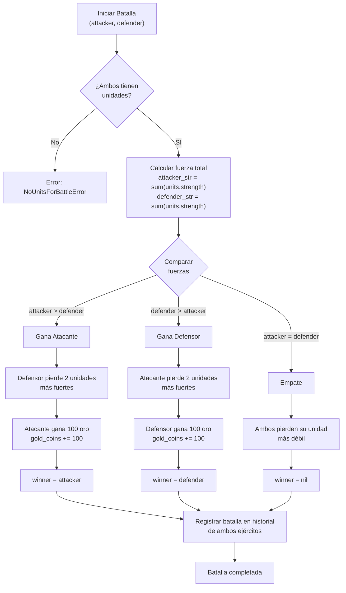

# Flujo de Batalla

Proceso completo de resolución de una batalla entre dos ejércitos.

## Consecuencias

- **Victoria**: Ganador obtiene 100 oro, perdedor pierde 2 unidades más fuertes
- **Empate**: Ambos pierden 1 unidad más débil
