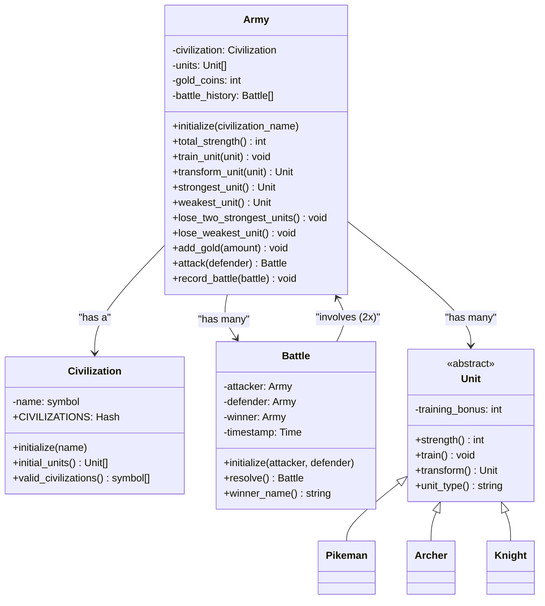

# Diagrama de Clases - Sistema Completo

Visión general del sistema completo incluyendo todas las entidades principales y sus relaciones.

## Estructura

- **Army**: Entidad principal que gestiona ejércitos
- **Civilization**: Configuración de civilizaciones
- **Battle**: Resolución de batallas
- **Unit** (con subclases): Modelo de unidades militares
