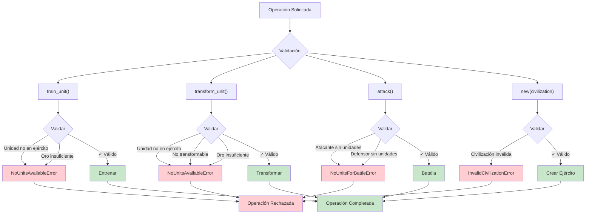

# Diagrama de Excepción - Validaciones

Sistema completo de validaciones y excepciones del sistema.

## Excepciones Personalizadas

- `NoUnitsAvailableError`: Unidad no pertenece al ejército
- `NoUnitsForBattleError`: Ejército sin unidades
- `TransformationNotAllowedError`: Unidad no transformable
- `InsufficientGoldError`: Oro insuficiente
- `InvalidCivilizationError`: Civilización no válida
