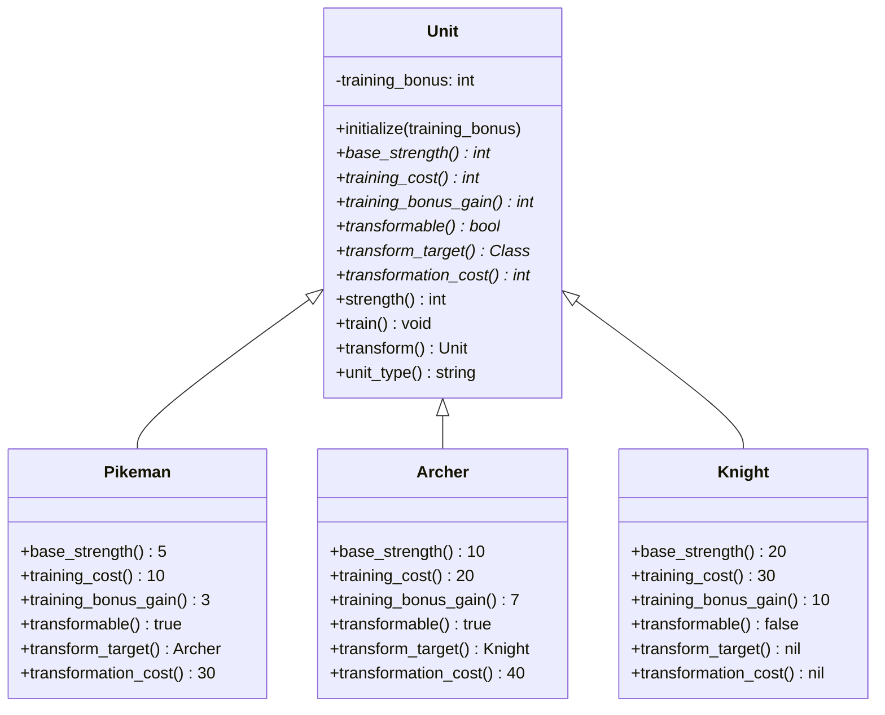

# Diagrama de Clases - Jerarquía de Unidades

Representa la estructura de herencia de las clases de unidades en el sistema.

## Características

- **Unit**: Clase base abstracta que define la interfaz común
- **Pikeman**: Primera forma, fuerza base 5
- **Archer**: Segunda forma, fuerza base 10
- **Knight**: Tercera forma (final), fuerza base 20
