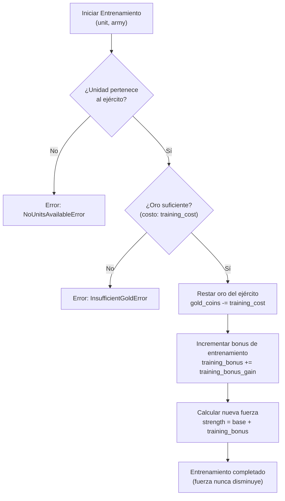

# Flujo de Entrenamiento de Unidad

Proceso completo de entrenamiento de una unidad militar.

## Pasos

1. Verificar que la unidad pertenece al ejército
2. Verificar que hay suficiente oro
3. Deducir el costo del entrenamiento
4. Incrementar el bonus de entrenamiento
5. Recalcular la fuerza total de la unidad
