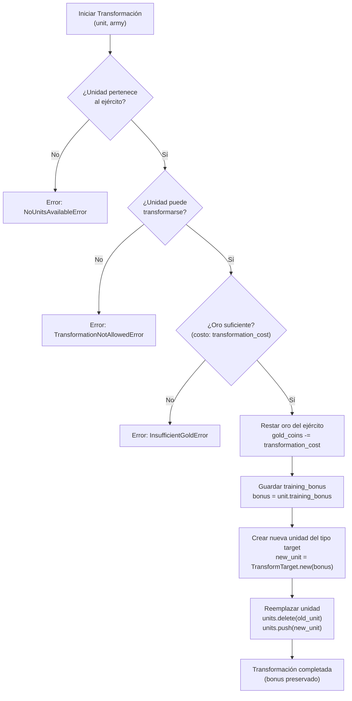

# Flujo de Transformación de Unidad

Proceso de transformación de una unidad a un tipo más fuerte, preservando el bonus de entrenamiento.

## Características Clave

- **Preservación de Bonus**: El bonus de entrenamiento se transfiere a la nueva unidad
- **Validación**: Solo ciertas unidades pueden transformarse
- **Costo**: Cada transformación tiene un costo en oro
